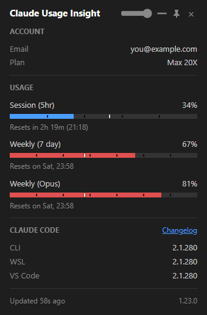
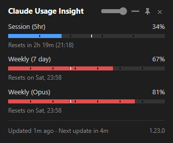
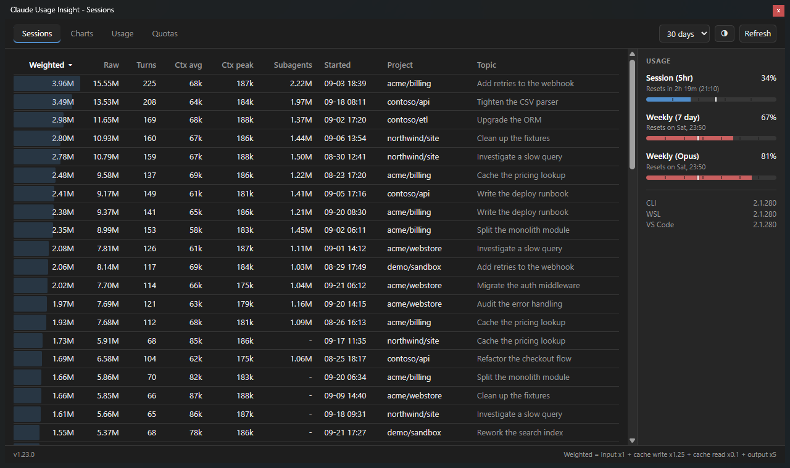
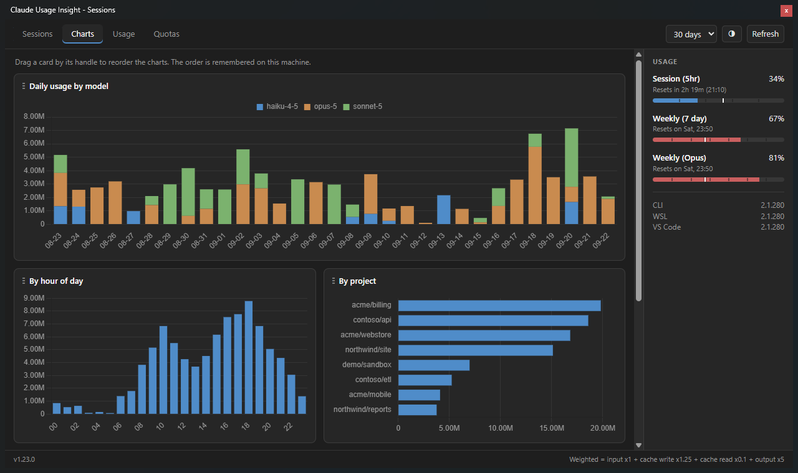
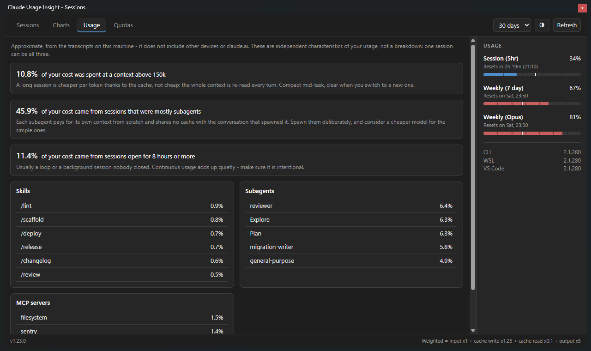
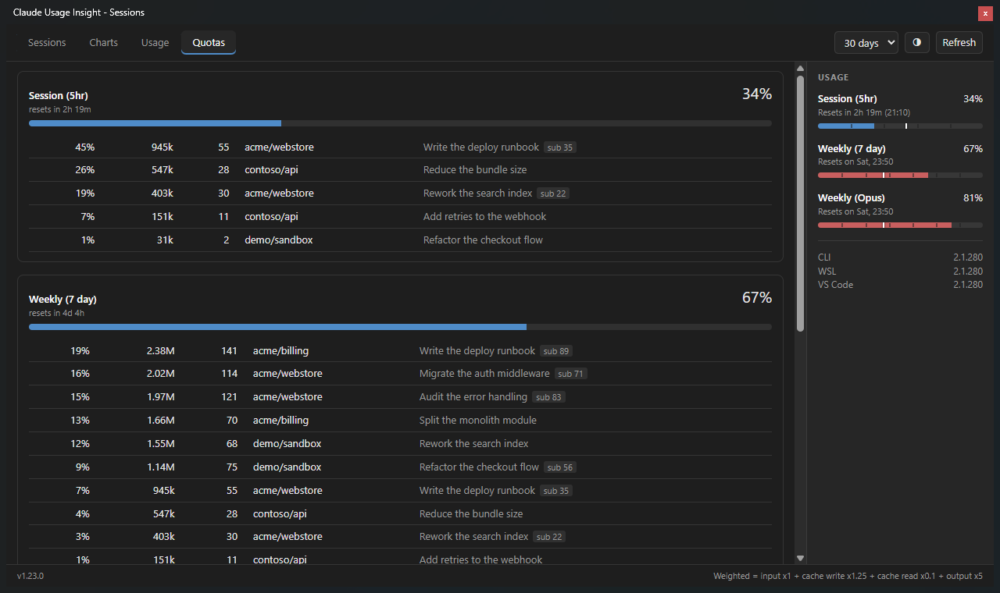
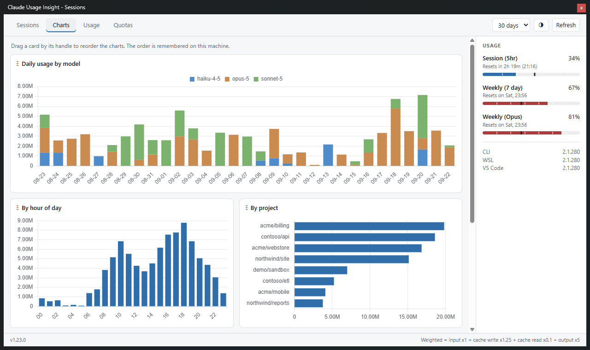

# Claude Usage Insight

[](https://github.com/jens-duttke/usage-monitor-for-claude)
[](https://template.dev.br/doar?template=github)

**Your Claude rate limits in the system tray - and, one click further, what actually spent them.**

A native tray app for Windows and Linux. The tray icon and popup answer *how much* of your session and weekly limits is gone, straight from the API. The session panel answers the question the bars cannot: *which session, which project, which subagent* burned it - by reading the Claude Code transcripts already on your machine.

Rate limits are shared across claude.ai, Claude Code, Claude Code Cowork, and the IDE extensions, so one number covers all of them.

<p align="center">
  
  &nbsp;&nbsp;
  
</p>

> [!NOTE]
> This is a fork of **[jens-duttke/usage-monitor-for-claude](https://github.com/jens-duttke/usage-monitor-for-claude)**. Everything above the session panel - the tray icon, the popup, the alerts, the polling, the 13 translations - is that project's work. See [Credits](#credits).

---

## What this fork adds

### Session panel: what spent the quota

Open it from the tray menu. It is a floating, resizable window with no taskbar button, so you can park it on a second monitor and leave it there.



Every session is ranked by **weighted cost**, not by raw token count:

```
weighted = input x1  +  cache write x1.25  +  cache read x0.1  +  output x5
```

Those are the published price ratios. It matters because raw totals lie: a long session that re-reads a large context every turn racks up millions of cache-read tokens that cost a tenth each, while a short session that writes a lot of code costs far more per token. Sorted by raw tokens, the cheap one comes first.

Each row carries the turn count, the average and peak context the turns were billed to read, and how much of the cost went to subagents.

### Charts

Daily usage split by model, usage by hour of day, usage by project, and a cost-per-turn curve for a single session - which is where a long conversation shows its shape: the price of a turn climbing with the context behind it, then dropping at a compaction.

Drag a card by its handle to reorder it. The order is remembered on that machine.



### Usage characteristics

Three independent characteristics of your own usage, each with what to do about it. They overlap on purpose - one session can be all three.



Below them, the share of cost attributable to each skill, each subagent type and each MCP server, attributed to the turn that issued the call.

> These numbers are computed from the transcripts on this machine, so they cover neither other devices nor claude.ai. Where `/usage` reports the same characteristic, expect the same ballpark rather than the same number - the definitions here are this app's own.

### Quota attribution

The percentage is the API's own - this app never estimates it. Underneath each live window sit the sessions whose turns fall inside it, so a 5-hour limit that is nearly gone names the sessions that got it there.



### Light and dark themes

The panel ships both palettes, including form controls and charts. Toggle it with the button in the header; it is remembered per machine.



### A popup you can leave on screen

Two additions to the tray popup, both on its title bar:

- **Collapse** strips it to the quota bars alone (second screenshot at the top of this page)
- **Opacity** fades it, so it can sit pinned over whatever you are working in

### WSL CLI detection

A Claude Code CLI installed inside WSL is found automatically and listed next to the native CLI and the IDE extensions, so you can see when one is behind the other.

---

## Features inherited from the upstream project

- **Portable on Windows** - single EXE, no installation, no Electron, no runtime required. Download, place anywhere, run. To uninstall, delete the file. On Linux it runs from source against the GTK and WebKit libraries your desktop already ships
- **Zero configuration** - authenticates through your existing Claude Code login, no API key or manual token entry needed
- **Live tray icon** with two [configurable](docs/configuration.md#tray-icon-bars) progress bars (session + weekly by default), or both values as stacked percentages via `icon_style`. Plus a [configurable tooltip](docs/configuration.md#tooltip-fields), percentage display, and theme-aware colors for light and dark taskbars
- **Detail popup** (left-click, or from the tray menu on Linux) with account info, reset countdowns, extra usage including the prepaid credits still available to pay for it, and dynamically detected bars for every active quota type (Session, Weekly, Sonnet, Opus, Fable, Cowork, and whatever Anthropic adds next), [selectable per field](docs/configuration.md#popup-fields). A stale-data indicator flags values that may be outdated. Pin it open and drag it anywhere
- **Claude Code versions** - which version is installed in each environment (native CLI, VS Code, Cursor, Windsurf), so you can spot when your IDE extension is ahead of or behind the CLI
- **Smart alerts** - configurable threshold notifications per quota type, with a time-aware mode that only alerts when usage outpaces elapsed time. Reset notifications when a nearly exhausted quota refills. Extra usage can also alert on absolute spending amounts
- **[Event commands](docs/event-commands.md)** - run a custom shell command when a quota resets, a usage threshold is crossed, the app starts up, or whenever you want via your **quick action** on the tray icon
- **Time marker** on every bar, in the popup, in the panel and on the tray icon alike, showing how much of the current period has elapsed - so you see at a glance whether your usage is ahead of or behind the clock. Bars that outpace it turn red
- **Automatic token refresh** - when the OAuth session expires, runs `claude update` in the background to renew the token without user intervention
- **Adaptive polling** - speeds up during active usage, slows to a 15-minute cadence when the computer is idle or locked, aligns to imminent quota resets, and backs off on rate-limit errors
- **Multi-account** - monitor several Claude accounts side by side with `--config-dir="<path>"`. Each instance gets its own tray icon, settings, session index and autostart entry
- **13 languages** (English, German, French, Spanish, Portuguese, Italian, Japanese, Korean, Hindi, Indonesian, Chinese Simplified, Chinese Traditional, Ukrainian) - auto-detected from your system's display language, with optional manual override via the `language` setting
- **[Customizable](docs/configuration.md)** - optionally override polling intervals, colors, alert thresholds, and more via a JSON settings file

---

## Security & Transparency

This tool handles your Claude Code OAuth token, so you should be able to verify it is safe. The codebase is deliberately structured for easy auditing:

- **Single network destination** - communicates exclusively with `api.anthropic.com`, no other hosts. Chart.js is bundled, not fetched from a CDN
- **Credentials stay local** - the OAuth token is used only in HTTP Authorization headers, never logged, stored elsewhere, or transmitted to third parties
- **Your transcripts never leave the machine** - the session panel reads them into a local SQLite index and nothing else. Token counts, timestamps, project names, session topics and tool names go in; message content does not. Delete the file at any time and the panel rebuilds it
- **Touches almost nothing** - usage data from the API lives in memory only. Two files are written next to your Claude configuration, and only once you use the features that need them: the session index, and a small file holding how you left the windows. Beyond those, on Windows the app writes no files at all; its only lasting traces are two `HKEY_CURRENT_USER` registry values (the toast notification identity, re-registered on every start, and the autostart entry, written only when you enable autostart). On Linux the same two concerns need files instead: an autostart `.desktop` entry, again only when you enable it, and a `0600` lock file in the session's runtime directory. [PRIVACY.md](PRIVACY.md) lists every one of them
- **No dynamic code execution** - no `eval()`, `exec()`, `compile()`, or dynamic imports
- **No obfuscation** - no encoded strings, no hidden URLs, no minified logic
- **Modular architecture** - small, focused modules with security-critical code (credentials, API calls) isolated in a single file ([`api.py`](usage_monitor_for_claude/api.py))
- **Minimal runtime dependencies** - only four well-known packages: [requests](https://pypi.org/project/requests/), [Pillow](https://pypi.org/project/pillow/), [pystray](https://pypi.org/project/pystray/), [pywebview](https://pypi.org/project/pywebview/)

---

## Antivirus Warnings

A few scanners flag `ClaudeUsageInsight.exe` as a trojan, and Chrome may cancel the download with "Virus found". This is a false positive.

**Where the warning comes from.** The app is a Python program shipped as a single portable EXE built with [PyInstaller](https://pyinstaller.org/). Such a bundle unpacks itself into a temporary directory on startup and runs the interpreter from there. That is what a self-extracting packer does, and malware is built with the same tool, so heuristic engines react to the packaging rather than to the program.

The detection names say as much. In `Trojan:Win32/Wacatac.B!ml` the `!ml` suffix means a machine-learning model produced the verdict instead of a signature match, and `Wacatac` is a generic bucket for "suspicious, unidentified". How widespread a file already is counts too, and a fork's first release is nowhere.

Chrome does not add a second opinion. It passes every downloaded executable to the antivirus installed on your machine and shows you that verdict, so the browser message and the scanner alert are one detection, not two.

**What you can do.**

- Restore the file from quarantine and add an exclusion for it.
- Report it to your vendor as a false positive. For Microsoft Defender, use [Submit a file for malware analysis](https://www.microsoft.com/en-us/wdsi/filesubmission).
- Or skip the packed EXE and [run from source](#building-from-source) instead - nothing is bundled there, and you can read every line before you start it.

---

## Requirements

- **Windows 10 or Windows 11** (64-bit), or **Linux** with a freedesktop desktop environment (see [Linux](#linux) below)
- **A Claude subscription** (Pro, Max, Team, or Enterprise) - the app displays the session and weekly rate limits that come with your plan. Pay-as-you-go API billing through the Anthropic Console has no such limits and is not supported
- **[Claude Code](https://docs.anthropic.com/en/docs/claude-code)** installed and logged in (CLI, VS Code extension, or JetBrains plugin - any variant works). The app reads the OAuth token that Claude Code stores locally (`~/.claude/.credentials.json`), or from `CLAUDE_CONFIG_DIR` when that is set; the `--config-dir="<path>"` command-line parameter overrides both

> [!TIP]
> If the token expires, the app automatically runs `claude update` to refresh it. If the token is missing entirely, the app shows a notification and a "!" icon - run `claude auth login` and the monitor picks the new token up automatically.

---

## Quick Start

**No Python required.** Download the latest [**ClaudeUsageInsight.exe**](https://github.com/danilo62x/claude-usage-insight/releases/latest), place it wherever you like, and run it. To remove, disable "Start at login" in the context menu first (if enabled), then delete the file.

> [!NOTE]
> This fork is not published to WinGet. If Windows or your browser reports the download as a virus, see [Antivirus Warnings](#antivirus-warnings) above.

Running this fork and the original at the same time is not supported: both use the same single-instance guard, so the second one to start hands over to the first. That is deliberate - two monitors polling the same account would double the API calls for nothing.

### Linux

There is no prebuilt binary: PyInstaller cannot bundle GTK and WebKit reliably, so the app runs from
source against the libraries your desktop already ships. Tested on Ubuntu with GNOME.

```bash
sudo apt install python3-venv python3-gi gir1.2-webkit2-4.1 \
                 gir1.2-ayatanaappindicator3-0.1 libayatana-appindicator3-1

git clone https://github.com/danilo62x/claude-usage-insight.git
cd claude-usage-insight

python3 -m venv --system-site-packages .venv
source .venv/bin/activate
pip install -r requirements.txt

python3 -m usage_monitor_for_claude
```

To start it again later, use the launcher - it needs no activated environment and works from any
directory:

```bash
~/claude-usage-insight/usage-monitor-for-claude
```

Symlink it once to get a global command, available in any shell and in your desktop's run dialog:

```bash
ln -s ~/claude-usage-insight/usage-monitor-for-claude ~/.local/bin/claude-usage-insight
```

Enable **Start at login** from the tray menu and the app takes care of the rest.

Three notes specific to Linux:

- **The virtual environment needs `--system-site-packages`.** PyGObject is installed by apt, not by
  pip; without that flag the app stops at `ModuleNotFoundError: No module named 'gi'`. If you already
  have a `.venv` created without it, set `include-system-site-packages = true` in `.venv/pyvenv.cfg`
  rather than recreating it - no reinstall needed.
- **The tray icon needs `gir1.2-ayatanaappindicator3-0.1`.** Without it no icon appears. Ubuntu
  enables the required GNOME extension by default; on plain GNOME you need
  [AppIndicator support](https://extensions.gnome.org/extension/615/appindicator-support/).
- **The app runs as an XWayland client.** Wayland does not let a client place its own windows, so
  the detail popup could not be anchored below the tray icon. The app sets `GDK_BACKEND=x11` itself;
  set that variable explicitly if you want to try the native backend.

The detail popup opens from the tray menu rather than a left-click: a StatusNotifierItem is drawn
and driven by the panel, so a click opens the menu and never reaches the application.

On startup the tray library prints `libayatana-appindicator is deprecated`. Nothing is broken - the
icon works as it should.

---

## How to Use

| Action | What happens |
|---|---|
| **Hover** over the tray icon | Tooltip shows 5h and 7d usage percentages with reset times |
| **Left-click** the tray icon | Opens the detail popup with account info and all usage bars |
| **Double-click** the tray icon | Runs your [quick action](docs/event-commands.md) if configured; otherwise does nothing. On Linux the desktop keeps the click, so the quick action sits in the tray menu instead |
| **Right-click** the tray icon | Context menu: open popup, **open the session panel**, autostart toggle, test event commands, restart, GitHub link, or quit |
| **Escape** or click outside | Closes the detail popup (unless it is pinned) |

### Reading the progress bars

Each bar, in the popup and in the panel alike, has up to four visual elements:

1. **Blue fill** - how much of the limit you have used
2. **Time dividers** - subtle gaps splitting the session bar into equal hour sections and marking local midnights on the weekly bars
3. **White vertical line** - how much *time* has passed in the current period. The fill turns **red** when it passes this marker, warning that you may hit the limit before the period resets
4. **Reset text** - when the limit resets, shown as a countdown with clock time

### The session index

The panel builds its index the first time you open it, then keeps it up to date incrementally: a transcript file whose modification time has not changed is skipped, so later refreshes cost a fraction of a second even across a large history. **Refresh** in the panel header forces a pass.

The index lives at `<Claude config>/usage-monitor-sessions.db`. Deleting it is safe - the panel rebuilds it on the next open.

---

## Configuration

All settings work out of the box - no configuration file is needed. To customize behavior, create a file called `usage-monitor-settings.json` with only the keys you want to change:

```json
{
  "poll_interval": 180,
  "bar_fg": "#00cc66",
  "bar_fg_warn": "#ff6600"
}
```

The app searches for this file in these locations (first match wins):

1. **`$CLAUDE_CONFIG_DIR/usage-monitor-settings.json`** (when a custom config directory is set via `--config-dir` or `CLAUDE_CONFIG_DIR`) - so each instance can have its own settings
2. **Next to the EXE** (or project root when running from source)
3. **`~/.claude/usage-monitor-settings.json`**

The app never creates or modifies this file. See [Configuration](docs/configuration.md) for all available settings.

---

## Building from Source

<details>
<summary>For developers who want to build the EXE themselves</summary>

### Prerequisites

- Python 3.10+
- pip

### Setup

Windows:

```bash
git clone https://github.com/danilo62x/claude-usage-insight.git
cd claude-usage-insight
python -m venv .venv
.venv\Scripts\activate
pip install -r requirements.txt
```

Linux - see [Linux](#linux) above for the apt packages this needs first:

```bash
git clone https://github.com/danilo62x/claude-usage-insight.git
cd claude-usage-insight
python3 -m venv --system-site-packages .venv
source .venv/bin/activate
pip install -r requirements.txt
```

`--system-site-packages` lets the environment see the distribution's PyGObject; `pip install
PyGObject` would build it from source and needs the GTK development headers.

### Run

```bash
python -m usage_monitor_for_claude
```

### Test

```bash
python -m unittest discover -s tests
```

The suite runs on both platforms. Tests for the backend of the *other* operating system skip
themselves at module level, so a green run means everything applicable to your system passed.

### Build EXE (Windows)

```bash
python build.py
```

Produces `dist/ClaudeUsageInsight.exe`, a single-file executable that bundles Python and all dependencies.

Your own build is unsigned. To sign it, install the Windows SDK signing tools and put a `signing.env` next to `build.py` with `SIGNING_THUMBPRINT` (a code signing certificate in your Windows certificate store) and `SIGNING_TIMESTAMP_URL`. Add `SIGNING_TIMESTAMP_FALLBACK_URL` to have a second timestamp server tried when the first one does not answer. The build then signs the executable and verifies the result, and a failure of either stops it.

There is no equivalent Linux build: PyInstaller cannot reliably bundle GTK and WebKit, so the app is
run from source there.

### UI development

The popup and the panel live in [`usage_monitor_for_claude/popup/`](usage_monitor_for_claude/popup/) and [`usage_monitor_for_claude/panel/`](usage_monitor_for_claude/panel/) as separate HTML, CSS and JS files. To preview the popup without running the full app:

```bash
start http://localhost:8080/usage_monitor_for_claude/popup/dev.html && python -m http.server 8080
```

On Linux, use `xdg-open` in place of `start`. Use the buttons to switch between data presets and the language dropdown to preview every locale, which is how you spot strings that overflow the popup width.

</details>

---

## Credits

This project is a fork of **[jens-duttke/usage-monitor-for-claude](https://github.com/jens-duttke/usage-monitor-for-claude)** by [Jens Duttke](https://github.com/jens-duttke), and would not exist without it. The tray integration, the popup, the quota detection, the alert logic, the adaptive polling, the platform layer and all 13 translations are his work, carried over here with the app renamed and the session panel added on top.

If this tool is useful to you, [sponsor the original author](https://github.com/sponsors/jens-duttke) - the foundation is his.

The session scanner that reads the Claude Code transcripts is adapted from [phuryn/claude-usage](https://github.com/phuryn/claude-usage) (MIT). Charts are drawn with [Chart.js](https://www.chartjs.org/) (MIT), bundled rather than loaded from a CDN. [THIRD-PARTY.md](THIRD-PARTY.md) has the details, and the license texts are in [LICENSE.claude-usage](LICENSE.claude-usage) and [LICENSE.chartjs](LICENSE.chartjs).

### Support this fork

If the session panel saved you a quota, you can [buy me a coffee](https://template.dev.br/doar?template=github). Entirely optional - the project is MIT and stays that way.

[](https://template.dev.br/doar?template=github)

---

## Contributing

Bug reports and pull requests are welcome. [Open an issue](https://github.com/danilo62x/claude-usage-insight/issues).

A bug in the tray icon, the popup or the quota bars most likely belongs [upstream](https://github.com/jens-duttke/usage-monitor-for-claude/issues) - reporting it there fixes it for every fork, and this one picks it up on the next merge.

<details>
<summary>For developers who want to contribute to the project</summary>

The [`.claude/CLAUDE.md`](.claude/CLAUDE.md) file contains the project conventions, coding standards and architectural guidelines, inherited from upstream and extended for the session panel.

- Security-critical code (credentials, API calls) stays isolated in [`api.py`](usage_monitor_for_claude/api.py)
- All user-facing changes need updates in [`CHANGELOG.md`](CHANGELOG.md), [`README.md`](README.md), and [`docs/configuration.md`](docs/configuration.md) where applicable
- Tests are required - run `python -m unittest discover -s tests` before committing
- Any new persistent write needs [`PRIVACY.md`](PRIVACY.md) and this README updated in the same change
- Keep the diff against upstream readable. A change that is not about the session panel is usually better sent upstream than kept here

</details>

---

## License

MIT, as upstream. See [LICENSE](LICENSE).

---

## Disclaimer

This is an independent, community-built project. It is **not** created, endorsed, or officially supported by [Anthropic](https://www.anthropic.com/). "Claude" and "Anthropic" are trademarks of Anthropic, PBC. Use of these names is solely for descriptive purposes to indicate compatibility.

It is equally not endorsed by the author of the upstream project. Report problems with this fork here, not there.

---

<sub>Screenshots on this page are rendered from a synthetic session index. The project and session names in them are made up.</sub>
